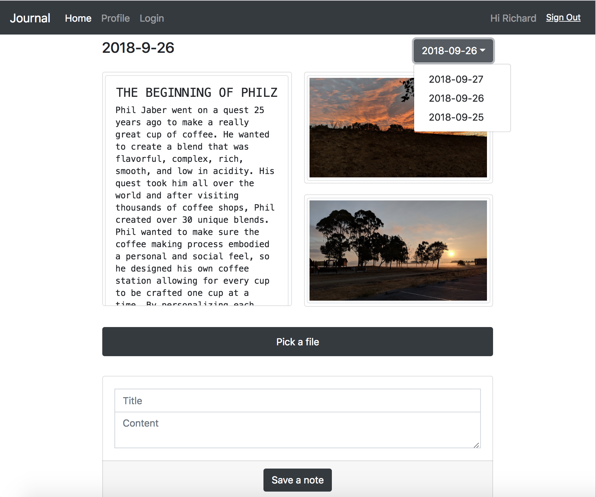

# Journal
Step by step tutorial to build a personal journal web app with ReactJS + AWS

**Update:** I am updating this tutorial with AWS Amplify 1.1 and Bootstrap 4.1. So far re-worked through step-07. Stay tuned.

* [Step 01 - Create a Basic React App with Bootstrap](step-01)
* [Step 02 - Authentication](step-02)
* [Step 03 - Authentication UI](step-03)
* [Step 04 - User Profile](step-04)
* [Step 05 - State Management via Redux](step-05)
* [Step 06 - Everyday Journal](step-06)
* [Step 07 - List of Journals](step-07)
* [Step 08 - Go Live](step-08)

Go to `journal` sub-folder of each step to check full source code, and run app.

[Live Demo](https://s3-us-west-1.amazonaws.com/journal-hosting-mobilehub-142591078/index.html#/)

**Note:** This is a personal experiment. Trying to see what would developers encounter when building a somewhat real app. This tutorial does not cover all aspects of AWS Amplify.

For most complete and up-to-date documentation, always check [official AWS Amplify site](https://aws-amplify.github.io/). The [Getting Started](https://aws-amplify.github.io/amplify-js/media/quick_start) is very nicely written.
