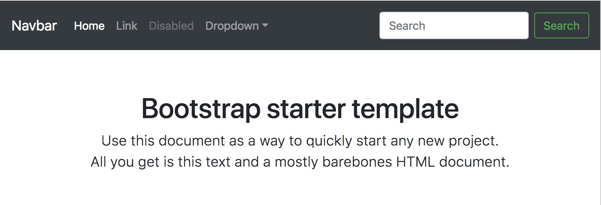
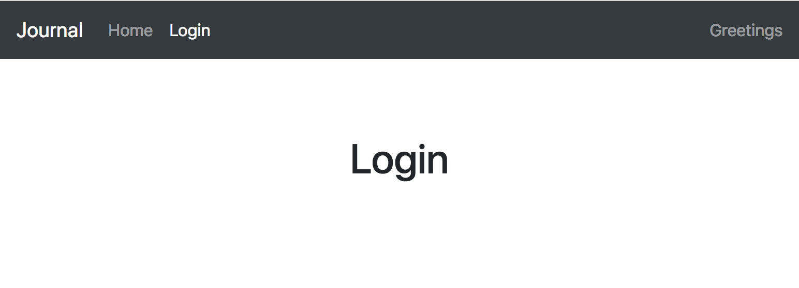

# Step 01 - Create a Basic React App with Bootstrap

* [1. Create Bootstrap React App](#1-create-bootstrap-react-app)
* [2. Add React Router](#2-add-react-router)
* [3. Update Navigator](#3-update-navigator)
* [4. Page Routing](#4-page-routing)
* [5. Create Home and Login Page](#5-create-home-and-login-page)
* [6. Run App](#6-run-app)

## 1. Create Bootstrap React App

[create-bootstrap-react-app](https://bootstrap-4-react.com/#cbra) creates basic React App with a Bootstrap starter template.

If not already installed, run
```bash
npm install --global create-react-app
npm install --global create-bootstrap-react-app
```

Then create the app
```bash
create-bootstrap-react-app journal
cd journal
npm start
```



## 2. Add React Router
Let's use [react-router](https://github.com/ReactTraining/react-router) for routing.
```bash
npm install --save react-router-dom
```

## 3. Update Navigator

We don't need everything from starter template. Let's start with a Home page and a Login page.

Open `src/components/Navigator.jsx`

* Update `<Navbar.Brand>` content to 'Journal'.
* Remove 'Disabled' and 'Dropdown' menu items.
* Update 'Link' to 'Login'.
* Replace search with 'Greetings' text.

With `react-router` components. `Navigator.jsx` become,

```javascript
import React, { Component } from 'react';
import { Navbar, Nav, BSpan } from 'bootstrap-4-react';
import { HashRouter, Route, Switch } from 'react-router-dom';

const HomeItems = props => (
  <React.Fragment>
    <Nav.ItemLink href="#/" active>
      Home
      <BSpan srOnly>(current}</BSpan>
    </Nav.ItemLink>
    <Nav.ItemLink href="#/login">
      Login
    </Nav.ItemLink>
  </React.Fragment>
)

const LoginItems = props => (
  <React.Fragment>
    <Nav.ItemLink href="#/">
      Home
    </Nav.ItemLink>
    <Nav.ItemLink href="#/login" active>
      Login
      <BSpan srOnly>(current}</BSpan>
    </Nav.ItemLink>
  </React.Fragment>
)

export default class Navigator extends Component {
  render() {
    return (
      <Navbar expand="md" dark bg="dark" fixed="top">
        <Navbar.Brand href="#">Journal</Navbar.Brand>
        <Navbar.Toggler target="#navbarsExampleDefault" />

        <Navbar.Collapse id="navbarsExampleDefault">
          <Navbar.Nav mr="auto">
            <HashRouter>
              <Switch>
                <Route exact path="/" component={HomeItems} />
                <Route exact path="/login" component={LoginItems} />
              </Switch>
            </HashRouter>
          </Navbar.Nav>
          <Navbar.Text>Greetings</Navbar.Text>
        </Navbar.Collapse>
      </Navbar>
    )
  }
}
```

## 4. Page Routing

Modify `src/components/Main.jsx` to route to Home or Login page.

```javascript
import React, { Component } from 'react';
import { Container } from 'bootstrap-4-react';
import { HashRouter, Route, Switch } from 'react-router-dom';

import { Home, Login } from '../pages';

export default class Main extends Component {
  render() {
    return (
      <Container as="main" role="main">
        <div className="starter-template">
          <HashRouter>
            <Switch>
              <Route exact path="/" component={Home} />
              <Route exact path="/login" component={Login} />
            </Switch>
          </HashRouter>
        </div>
      </Container>
    )
  }
}
```

## 5. Create Home and Login Page

We don't have Home and Login page yet. Let's create them.

`src/pages/Home.jsx`
```javascript
import React, { Component } from 'react';

export default class Home extends Component {
  render() {
    return (
      <h1>Home</h1>
    )
  }
}
```

`src/pages/Login.jsx`
```javascript
import React, { Component } from 'react';

export default class Home extends Component {
  render() {
    return (
      <h1>Login</h1>
    )
  }
}
```

## 6. Run App

```bash
npm start
```



[Step 02 - Amplify Authentication](../step-02)
