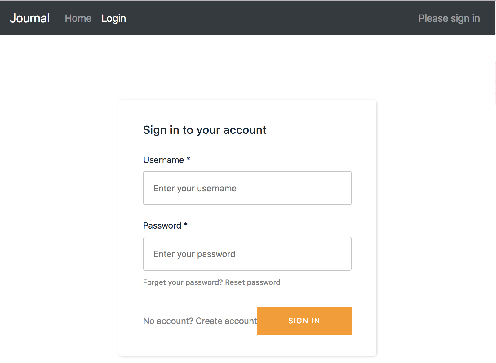
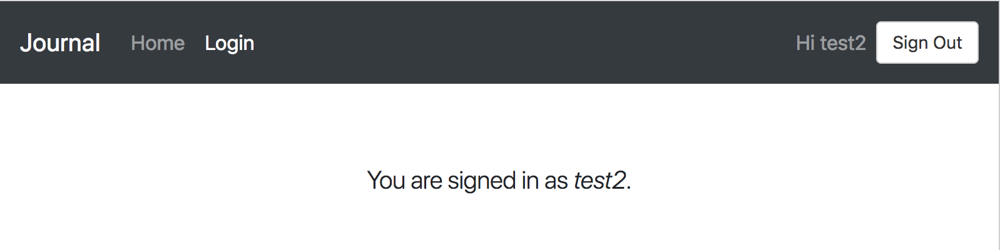

# Step 02 - Authentication

AWS Amplify solved the authentication for developers. Let's use it.

* [1. Prepare](#1-prepare)
* [2. Configure AWS Amplify](#2-configure-aws-amplify)
* [3. Add Authenticator](#3-add-authenticator)
* [4. Greetings](#4-greetings)
* [5. Home Page Aware of authState](#5-home-page-aware-of-authstate)
* [6. Run App](#6-run-app)
* [7. Fun Theme](#7-fun-theme)

## 1. Prepare

### Library

Install package, core library and react specific.

```
npm install --save aws-amplify
npm install --save aws-amplify-react
```

### Service

Create a AWS Mobile Hub project with [awsmobile-CLI](https://github.com/aws/awsmobile-cli)

```
npm install -g awsmobile-cli

awsmobile configure # first time use of CLI, setup with AWS_ACCESS_KEY and AWS_SECRET_KEY

awsmobile init
awsmobile user-signin enable
awsmobile user-files enable
awsmobile push
```

This [guide](https://aws.github.io/aws-amplify/media/quick_start#set-up-your-backend) have detailed information of how to setup a AWS Mobile Hub and work with AWS Amplify.

## 2. Configure AWS Amplify

Open `src/App.js`, add these lines

```
import Amplify from 'aws-amplify';
import aws_exports from './aws-exports';

Amplify.configure(aws_exports);
```

## 3. Add Authenticator

Open `src/modules/Login.jsx`, change content to:

```
import React, { Component } from 'react';

import { Authenticator } from 'aws-amplify-react';

export default class Login extends Component {
    render() {
        return <Authenticator />
    }
}
```

Now `npm start`. Login becomes real



Got ahead sign up and sign in. Create a test user.

## 4. Greetings

Notice after sign in, there is a sign out button. It makes sense to have sign out button. However in our case the place is not right.

**Hide Greetings**

Let's hide this one. `src/modules/Login.jsx` becomes:

```
import React, { Component } from 'react';

import { Authenticator, Greetings } from 'aws-amplify-react';

export default class Login extends Component {
    render() {
        return <Authenticator hide={[Greetings]} />
    }
}
```

`Authenticator` is composed of a group of pieces, `Greetings` is one of them. `hide` defines a list of pieces to be hidden.

**Greetings on Menu**

What we actually want is greetings on the top-right corner. Let's edit `src/App.js` to add menu item with Greetings.

First import Greetings

```
import { Greetings } from 'aws-amplify-react';
```

The default styling doesn't fit in our UI, lets add the menu item and remove default theme of Greetings.

```
const GreetingsTheme = {
    navButton: {
        border: '0',
        background: 'white',
        color: 'blue',
        borderBottom: '1px solid',
        fontSize: '0.8em'
    }
}

...

    <Menu.Menu position="right">
        <Menu.Item>
            <Greetings theme={GreetingsTheme} />
        </Menu.Item>
    </Menu.Menu>
```

**Custom Greetings**

Change the greetings

```
    <Greetings
        theme={GreetingsTheme}
        outGreeting="Welcome"
        inGreeting={(username) => `Hi ${username}`}
    />
```



## 5. Home Page Aware of authState

Now sign in works. How does Home page know if an user is signed in or not?

We have `Greetings` now. So just listen to its `onStateChange` event, then pass to Home component in router.

In `src/App.js`

```
    constructor(props) {
        ...
        this.handleStateChange = this.handleStateChange.bind(this);
        this.state = {
            authData: null,
            authState: null
        }
    }

    handleStateChange(authState, authData) {
        this.setState({
            authState,
            authData
        });
    }
```

```
        <Greetings
            theme={GreetingsTheme}
            outGreeting="Welcome"
            inGreeting={(username) => `Hi ${username}`}
            onStateChange={this.handleStateChange}
        />
```

```
        <Route exact path="/" name="home" render={(props) => (
            <Home {...props}
                authState={this.state.authState}
                authData={this.state.authData}
            />
        )}/>
```

Then, in `src/modules/Home.jsx`, just check `authState` property

```
    render() {
        const { authState, authData } = this.props;
        return (
            <div id="home-module">
                <Header as="h1">Home</Header>
                <div>{authState}</div>
            </div>
        );
    }
```

## 6. Run App

```
npm start
```

## 7. Fun Theme

AWS Amplify is theme based. [a-theme-react](https://github.com/richardzcode/a-theme-react) has a couple example. Let have some fun.

Install `a-theme-react`

```
npm install --save a-theme-react
```

Then apply a theme in your `modules/Login.jsx`:

```
...

import { Instagram } from 'a-theme-react';

export default class Login extends Component {
    render() {
        return (
            <Authenticator theme={Instagram} hide={[Greetings]} />
        )
    }
}
```

Now run app, see what happens to your login page :)

[Step 03 - Authentication UI](../step-03)
