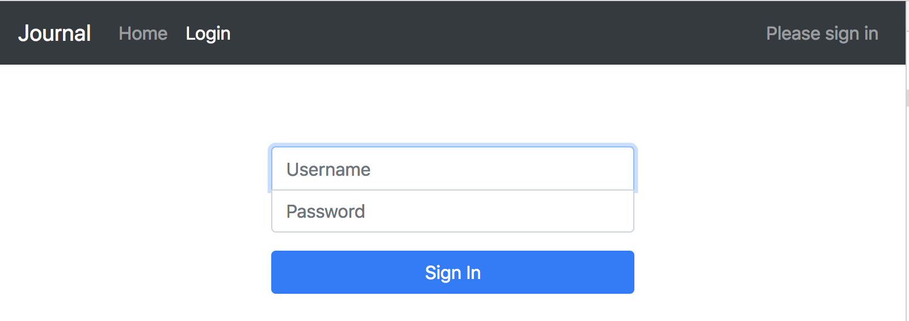
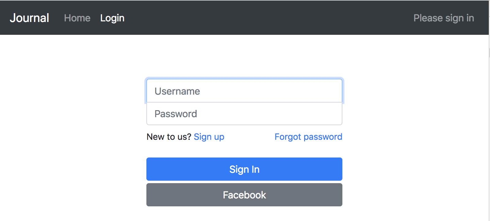

# Step 03 - Authentication UI

The default Auth UI looks good. However we just like perfection. Let's replace it.

* [1. Replace Sign Out](#1-replace-sign-out)
* [2. Replace Sign In](#1-replace-sign-in)
* [3. Integrate JSignIn with Authenticator](#3-integrate-jsignin-with-authenticator)
* [4. Federated Sign In](#4-federated-sign-in)
* [5. Confirm Sign In](#5-confirm-sign-in)
* [6. Check Contact Verification](#6-check-contact-verication)
* [7. Sign Up](#7-sign-up)
* [8. Replace all Auth components](#8-replace-all-auth-components)
* [9. Run App](#9-run-app)

## 1. Replace Sign Out

Start from the easiest, `<SignOut>` button. Not only it has the least elements, but also it lives outside of `<Authenticator>`

create `src/components/auth/JSignOut.jsx`
```
import React, { Component } from 'react';
import { Button } from 'bootstrap-4-react';
import { Auth } from 'aws-amplify';

export default class JSignOut extends Component {
  constructor(props) {
    super(props);
    this.signOut = this.signOut.bind(this);
  }

  signOut() {
    Auth.signOut();
  }

  render() {
    return (
      <Button light outline sm border="0" onClick={this.signOut}>Sign Out</Button>
    )
  }
}
```

Update `src/components/Navigator.jsx` to import and render `<JSignOut>` instead.

```
import { JSignOut } from './auth';

...
  render() {
    ...
          { user && <JSignOut /> }
    ...
  }
...
```


## 2. Replace Sign In

Let's create a sign in form.

Save the form to `src/components/auth/JSignIn.jsx`. Implement sign in,

```
  signIn() {
    const { username, password } = this.inputs;
    Auth.signIn(username, password)
      .then(user => this.signInSuccess(user))
      .catch(err => this.signInError(err));
  }
```

Then modify `src/pages/Login.jsx`, hide the default `<SignIn>`, add our `<JSignIn>`
```
import React, { Component } from 'react';
import { Lead, BSpan } from 'bootstrap-4-react';
import { Authenticator, SignIn } from 'aws-amplify-react';

import { JSignIn } from '../components/auth';

const CustomAuthenticator = props => (
  <Authenticator hide={[SignIn]}>
    <JSignIn />
  </Authenticator>
)

export default class Login extends Component {
  render() {
    const { user } = this.props;

    return (
      <React.Fragment>
        { !user && <CustomAuthenticator /> }
        { user && <Lead>You are signed in as <BSpan font="italic">{user.username}</BSpan>.</Lead> }
      </React.Fragment>
    )
  }
}
```



## 3. Integrate JSignIn with Authenticator

When sign in successful with `<JSignIn>` seems nothing actually happens. This is because by default user is required to confirm sign in via SMS. We don't have that yet. `<Authenticator>` has the confirm SMS form. Let's see how to link `<JSignIn>` with other forms.

**Emit authState/authData**

By putting a component inside `<Authenticator>`, a few properties are injected by it. One of the properties is `onStateChange`. Every component inside `<Authenticator>` should notify auth state change via this handler.

Modify `src/components/auth/JSignIn.jsx`,

```
  signInSuccess(user) {
    this.setState({ error: '' });

    const { onStateChange } = this.props;
    if (!onStateChange) { return; }

    if (user.challengeName === 'SMS_MFA' || user.challengeName === 'SOFTWARE_TOKEN_MFA') {
      onStateChange('confirmSignIn', user);
    } else {
      onStateChange('signedIn', user);
    }
  }
```

**Hide JSignIn after Sign In**

Notice `<JSignIn>` shows along with confirmation form. We should fix it.

Every component inside `<Authenticator>` got `authState` property. So just check `authState` in `render` method. JSignIn should show up in three states: 'signIn', 'signedOut', 'signedUp'
```
    render() {
        const { authState } = this.props;
        if (!['signIn', 'signedOut', 'signedUp'].includes(authState)) { return null; }

        ...
```

## 4. Federated Sign In

`withFederated` HOC turns buttons into Federated sign in button.

* Build UI
  - style your own button
  - trigger `props.facebookSignIn | props.googleSignIn | props.amazonSignIn` at the right time
* Transform UI
  - withFederated(...)
* Render UI
  - pass in `federated` property with app ids
  - handle `onStateChange` to notify sign in event

```
import { withFederated } from 'aws-amplify-react';

const FederatedButtons = (props) => (
  <Button
    secondary
    mt="1"
    style={{ width: '100%' }}
    onClick={props.facebookSignIn}
  >
    Facebook
  </Button>
);

const Federated = withFederated(FederatedButtons);

const federated_data = {
    google_client_id: '',
    facebook_app_id: '__replace_with_your_facebook_app_id__',
    amazon_client_id: ''
};

...

    // in login form render method,
    // trigger props.onStateChange when state changes, i.e. signed in
    <Federated federated={federated_data} onStateChange={this.props.onStateChange} />

```

## 5. Confirm Sign In

Now let's replace sign in confirmation form.

Create `src/components/JConfirmSignIn.jsx` with

```
    Auth.confirmSignIn(user, code, mfaType)
      .then(() => this.confirmSuccess(user))
      .catch(err => this.confirmError(err));
```

Then add it to `<CustomAuthenticator>` like we did for `<JSignIn>`

## 6. Check Contact Verification

User may forget password. In order to be able to recover password, user has to have one of the contact info verified. We should prompt user about this.

The check may happen in both `<JSignIn>` and `<JConfirmSignIn>`. We show one example, the other is same.

Update `src/components/auth/JSignIn.jsx`:
```
    constructor(props) {
        super(props);

        this.checkContat = this.checkContact.bind(this);
        this.signIn = this.signIn.bind(this);
    }

    checkContact(user) {
        Auth.verifiedContact(user)
            .then(data => {
                if (!JS.isEmpty(data.verified)) {
                    this.changeState('signedIn', user);
                } else {
                    user = Object.assign(user, data);
                    this.changeState('verifyContact', user);
                }
            });
    }

    signIn() {
        const { username, password } = this.inputs;
        logger.debug('username: ' + username);
        Auth.signIn(username, password)
            .then(user => this.checkContact(user))
            .catch(err => this.error(err));
    }
```

Do the same to `src/components/auth/JConfirmSignIn.jsx`.

## 7. Sign Up

`<JSignIn>` should have a way to go to sign up form. Inside `<Authenticator>` this is achieved by emitting `authState` 'signUp'

```
            <Col text="left">
              New to us?{' '}
              <BA href="#" preventDefault onClick={() => this.changeState('signUp')}>
                Sign up
              </BA>
            </Col>
```

Now on click we'll see Sign Up form, but it is the default form. Go through the same process create a RegisterForm. Same to other UI components in auth flow.

## 8. Replace all Auth components

**hideDefault**

In order to replace default Auth forms, we provide `hide` list to `Authenticator`. Once all replaced, we could simply pass a `hideDefault` property, no need to write the whole list.

```
    <Authenticator hideDefault />
```

## 9. Run App

```
npm start
```



[Step 04 - Everyday Journal](../step-04)
