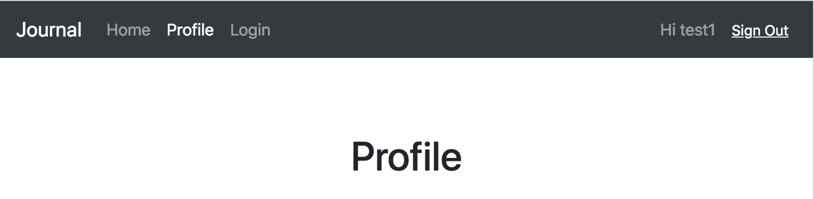
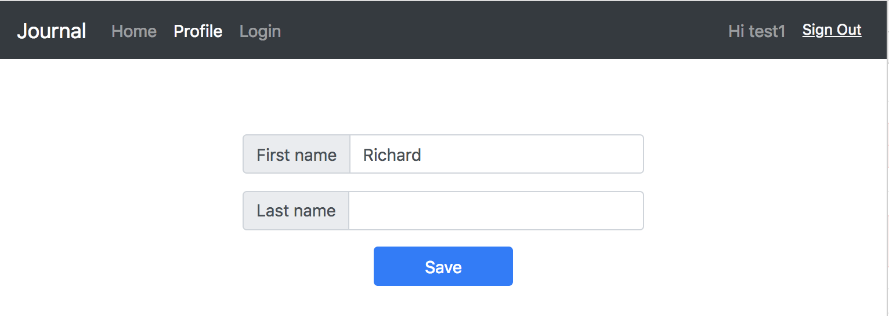

# Step 04 - User Profile

Let's build a simple user profile page with some user attributes.

* [1. Create Profile Page](#1-create-profile-page)
* [2. Load User Attributes](#2-load-user-attributes)
* [3. Save User Attributes](#3-save-user-attributes)
* [4. Run App](#4-run-app)

## 1. Create Profile Page

Create `src/pages/Profile.jsx`, then add to `<Navigator>`

Modify `src/components/Navigator.jsx`

```javascript
const ProfileItems = props => (
  <React.Fragment>
    <Nav.ItemLink href="#/">
      Home
    </Nav.ItemLink>
    <Nav.ItemLink href="#/profile" active>
      Profile
    </Nav.ItemLink>
    <Nav.ItemLink href="#/login">
      Login
      <BSpan srOnly>(current}</BSpan>
    </Nav.ItemLink>
  </React.Fragment>
)


...
  render() {
    ...
                <Route exact path="/profile" component={ProfileItems} />
    ...
  }
```

Add to `<Main>`

```javascript
              <Route
                exact
                path="/profile"
                render={(props) => <Profile user={user} />}
              />
```



## 2. Load User Attributes

We call `Auth.userAttributes` to load attributes. `user` is a property of `<Profile>` component. It may change after mount, so we need to listen to `componentDidUpdate` as well as `componentDidMount`

```javascript
  componentDidMount() {
    if (this.props.user) { this.loadProfile() }
  }

  componentDidUpdate(prevProps) {
    if (!prevProps.user && this.props.user) {
      this.loadProfile();
    }
  }

  loadProfile() {
    const { user } = this.props;
    Auth.userAttributes(user)
      .then(data => this.loadSuccess(data))
      .catch(err => this.handleError(err));
  }

  loadSuccess(data) {
    logger.info('loaded user attributes', data);
    const profile = this.translateAttributes(data);
    this.setState({ profile: profile });
  }

  handleError(error) {
    logger.info('load / save user attributes error', error);
    this.setState({ error: error.message || error });
  }

  translateAttributes(data) {
    const profile = {};
    data
      .filter(attr => ['given_name', 'family_name'].includes(attr.Name))
      .forEach(attr => profile[attr.Name] = attr.Value);
    return profile;
  }
```

`render` the component
```javascript
  render() {
    const { profile, error } = this.state;

    return (
      <Container display="flex" flex="column" alignItems="center">
        <InputGroup mb="3" style={{ maxWidth: '24rem' }}>
          <InputGroup.PrependText>First name</InputGroup.PrependText>
          <Form.Input
            type="text"
            defaultValue={profile.given_name}
            onChange={event => this.handleInputChange('given_name', event.target.value)}
          />
        </InputGroup>
        <InputGroup mb="3" style={{ maxWidth: '24rem' }}>
          <InputGroup.PrependText>Last name</InputGroup.PrependText>
          <Form.Input
            type="text"
            defaultValue={profile.family_name}
            onChange={event => this.handleInputChange('family_name', event.target.value)}
          />
        </InputGroup>
        <Button primary px="5" onClick={this.saveProfile}>Save</Button>
        { error && <Alert warning>{error}</Alert> }
      </Container>
    )
  }
```

To keep simple we just cover 'given_name' and 'family_name', which are in 'standard attributes' list from Cognito:
[Configuring User Pool Attributes](https://docs.aws.amazon.com/cognito/latest/developerguide/user-pool-settings-attributes.html)

## 3. Save User Attributes

For saving, we call `Auth.updateUserAttributes`

```javascript
  saveProfile() {
    const { user } = this.props;
    if (!user) {
      this.handleError('No user to save to');
      return;
    }

    Auth.updateUserAttributes(user, this.state.profile)
      .then(data => this.saveSuccess(data))
      .catch(err => this.handleError(err));
  }
```

## 4. Run App

```bash
npm start
```



[Step 05 - State Management via Redux](../step-05)
