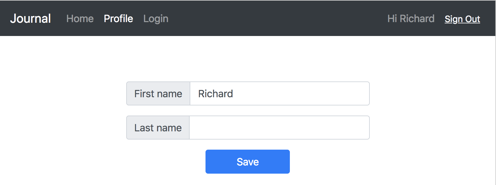

# Step 05 - State Management via Redux

We now have two states that may be used across app. 1) User, specifically user sign in / out state; 2) User profile. It is time to introduce state management tool.

State management tool essentially is a pub-sub system with or without a mutable or immutable store. [Redux](https://redux.js.org/) is one of the most popular options. Let's integrate Amplify with Redux.

* [1. Install Redux](#1-install-redux)
* [2. Redux Files](#2-redux-files)
* [3. Amplify Bridge](#3-amplify-bridge)
* [4. Listen to Redux Store](#4-listen-to-redux-store)
* [5. Dispatch to Redux Store](#5-dispatch-to-redux-store)
* [6. Run App](#6-run-app)

## 1. Install Redux

```
npm install --save redux
```

## 2. Redux Files

Then create a `store` module with Redux. We build these files:

```
└── store
    ├── actions.js
    ├── index.js
    └── reducers.js
```

#### Actions

`actions.js` defines Redux [Actions](https://redux.js.org/basics/actions). So far we have three actions,

```
const SWITCH_USER = 'SWITCH_USER';

const UPDATE_PROFILE = 'UPDATE_PROFILE';
const DELETE_PROFILE = 'DELETE_PROFILE';

// when user sign in / out
function switchUser(user) {
  return {
    type: SWITCH_USER,
    user
  }
}

// when user update profile
function updateProfile(profile) {
  return {
    type: UPDATE_PROFILE,
    profile
  }
}

// when user sign out
function deleteProfile() {
  return { type: DELETE_PROFILE }
}

export { SWITCH_USER, UPDATE_PROFILE, DELETE_PROFILE }
export { switchUser, updateProfile, deleteProfile }
```

#### Reducers

`reducers.js` defines Redux [Reducers](https://redux.js.org/basics/reducers). Let's build two reducers, then combine them into 'Journal'.

Notice we don't use `Object.assign` in `switchUser` reducer like normal Redux examples. That was intentional. Becuase `Object.assign` does not copy methods, which we need later.

```
import { combineReducers } from 'redux';

import { SWITCH_USER, UPDATE_PROFILE, DELETE_PROFILE } from './actions';

function user(state={}, action) {
  switch(action.type) {
    case SWITCH_USER:
      return action.user;
    default:
      return state;
  }
}

function profile(state={}, action) {
  switch(action.type) {
    case UPDATE_PROFILE:
      return Object.assign(
        {},
        state,
        action.profile
      );
    case DELETE_PROFILE:
      return null;
    default:
      return state;
  }
}

const Journal = combineReducers({
  user,
  profile
});

export default Journal;
```

#### Store

`index.js` create and export a Redux [Store](https://redux.js.org/basics/store).

```
import { createStore } from 'redux';

import Journal from './reducers';

const store = createStore(Journal);

export default store;
```

## 3. Amplify Bridge

Then we create `AmplifyBridge.js` to link Amplify `Hub` with Redux.

```
└── store
    └── AmplifyBridge.js
```

```
export default class AmplifyBridge {
  constructor(store) {
    this.store = store;

    this.onHubCapsule = this.onHubCapsule.bind(this);
    Hub.listen('auth', this, 'AmplifyBridge'); // Add this component as a listener of auth events.

    this.checkUser(); // first check
  }

  onHubCapsule(capsule) {
    this.checkUser(); // triggered every time user sign in / out
  }

  checkUser() {
    Auth.currentAuthenticatedUser()
      .then(user => {
        this.store.dispatch(switchUser(user));
        this.loadProfile(user);
      })
      .catch(err => {
        this.store.dispatch(switchUser(null));
        this.store.dispatch(deleteProfile());
      });
  }

  loadProfile() {
    Auth.userAttributes(user)
      .then(data => {
        const profile = this.translateAttributes(data);
        this.store.dispatch(updateProfile(profile));
      })
      .catch(err => this.store.dispatch(deleteProfile(err)));
  }
}
```

Then we just create the bridge at `src/App.js`

```
import store, { AmplifyBridge } from './store';

new AmplifyBridge(store);
```

## 4. Listen to Redux Store

Now everytime user sign in / out, Redux store is updated with user and profile. Across app we just need to `subscribe` to the store.

In `src/components/Navigator.jsx` we can do some clean up now.

```
  constructor(props) {
    super(props);

    this.storeListener = this.storeListener.bind(this);

    this.state = { user: null, profile: null }
  }

  componentDidMount() {
    this.unsubscribeStore = store.subscribe(this.storeListener);
  }

  componentWillUnmount() {
    this.unsubscribeStore();
  }

  storeListener() {
    logger.info('redux notifivation');
    const state = store.getState();
    this.setState({ user: state.user, profile: state.profile });
  }
```

Since we have profile too, small update to greetings in `<Navigator>`

```
            { user? 'Hi ' + (profile.given_name || user.username) : 'Please sign in' }
```

Things are getting easier and cleaner.

Then do the same to `src/components/Main.jsx`

## 5. Dispatch to Redux Store

Amplify `Hub` captures user sign in / out, we just pipe to Redux. For user profile changes we have to dispatch to store manually.

```
  saveSuccess(data) {
    logger.info('saved user profile', data);
    store.dispatch(updateProfile(this.state.profile));
  }
```

## 6. Run App

Now run app, update first name and notice greeting changes right after you click 'Save'

```
npm start
```



[Step 06 - Everyday Journal](../step-06)
