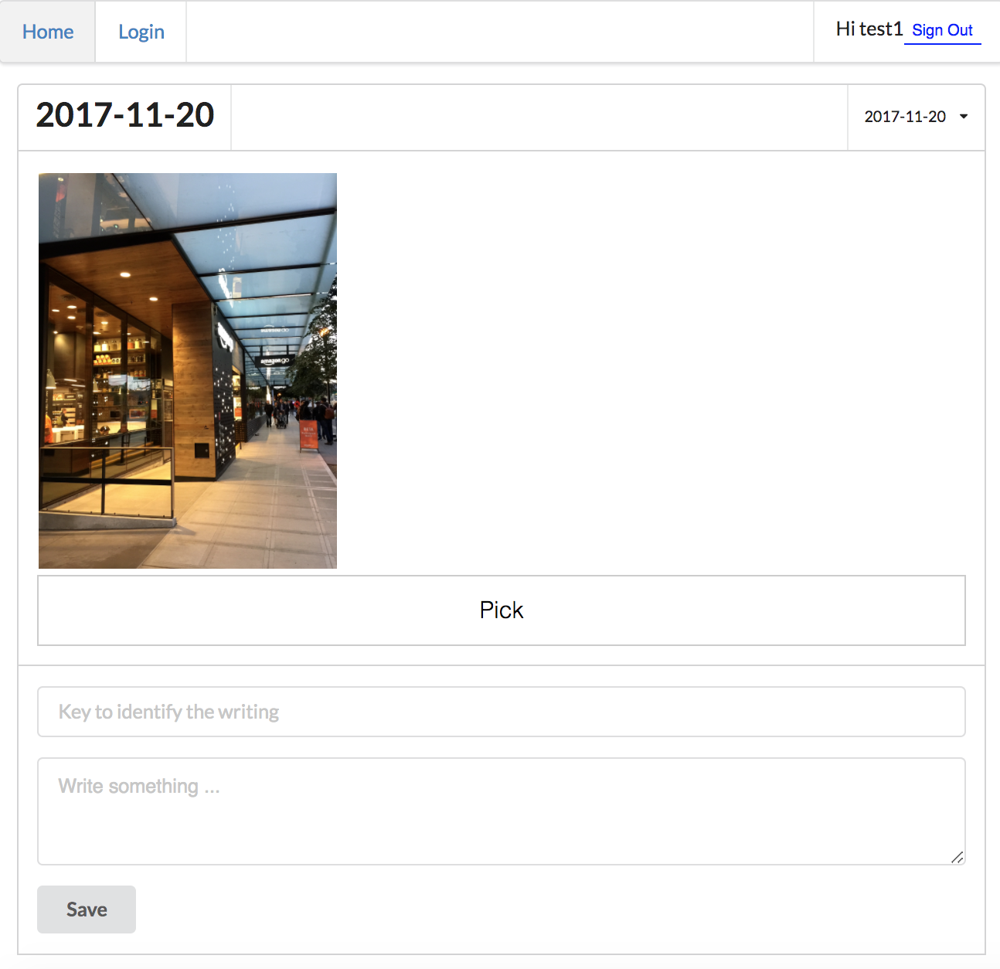

# Step 05 - List of Journals

We have a journal now, but only for today. What about history?

* [1. Get List](#1-get-list)
* [2. Display Dates](#display-dates)
* [3. Switch Date](#switch-date)
* [4. Run App](#run-app)

## 1. Get List

Over time user may record lots of daily happenings. That can be handled by a little bit more data structure. In this turorial we keep it simple, just list all memories and extract out dates from the list.

Get list of everything
```
    Storage.list(user.id)
        .then(data => {
            logger.debug('list of everything', data);
            this.extractDates(data);
        })
        .catch(err => logger.error('error when get list of everything', err));
```

Extract dates
```
    extractDates(list) {
        const date_list = list.map(item => {
            const match = item.key.match(/\/(\d{4}-\d{2}-\d{2})\//);
            return match? match[1] : null;
        });

        const unique_dates = Array.from(new Set(date_list)).sort().reverse();
        this.setState({ dates: unique_dates });
    }
```

## 2. Display Dates

Convert to dropdown options
```
    const history = dates.map(date => {
        return {
            key: date,
            value: date,
            text: date
        };
    });
```

Display
```
        <Dropdown
            position="right"
            placeholder="History"
            options={history}
            onChange={this.handleDateChange}
        />
```

## 3. Switch Date

```
    handleDateChange(evt, data) {
        const date = data.value;
        const { user } = this.state;
        const path = user.id + '/' + date + '/';

        this.setState({
            date: date,
            path: path
        });
    }
```

## 4. Run App

```
npm start
```



[Step 06 - Go Live](../step-06)
