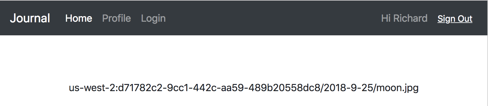
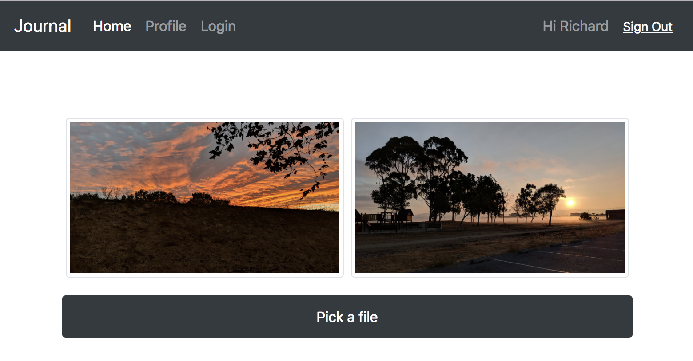
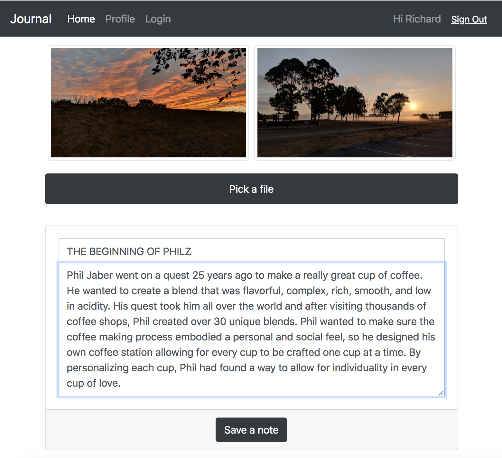
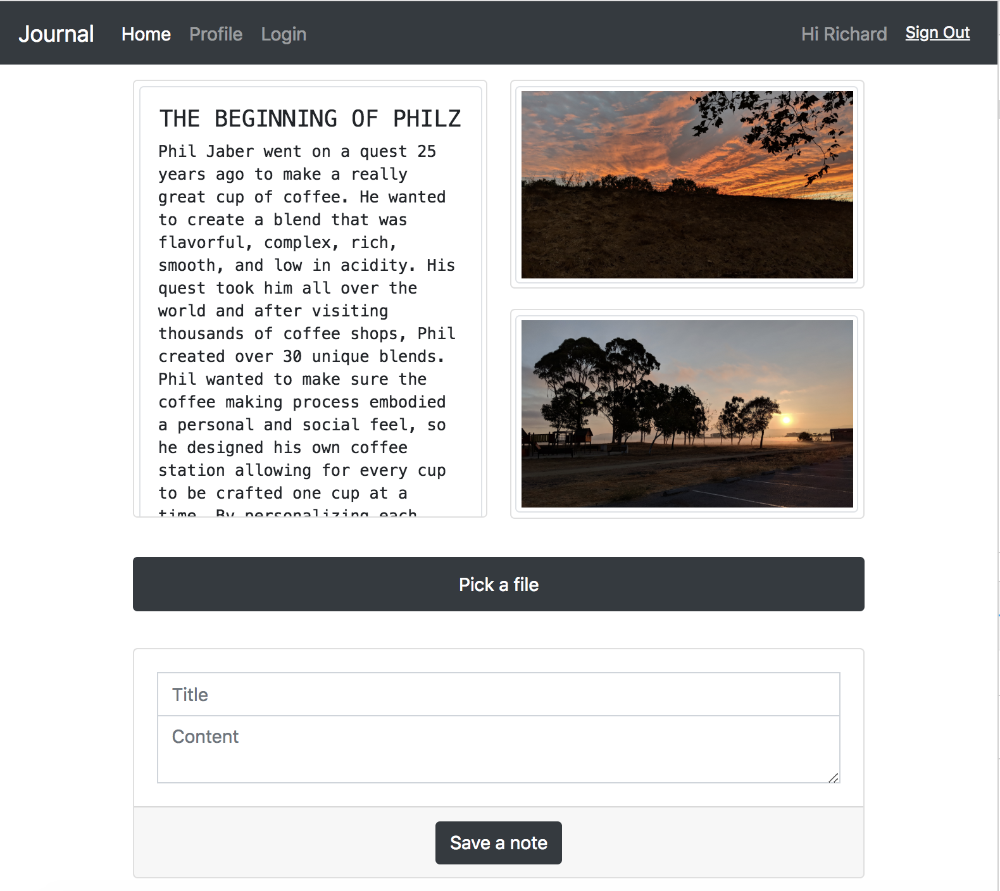

# Step 06 - Everyday Journal

Now, let's build some features. We are going to build an app that let users store everyday journal.

* [1. User Information](#1-user-information)
* [2. Daily Album](#2-daily-album)
* [3. Create Album Component](#3-create-album-component)
* [4. Refresh Album](#4-refresh-album)
* [5. Upload Text](#5-upload-text)
* [6. Run App](#5-run-app)

## 1. User Information

First we need to make sure every user has his/her own space. `user_id` is a good choice. However the user object from `Auth.currentAuthenticatedUser` does not have user_id. `Auth.currentUserInfo` has. Can we combine these two together?

With Redux integrated, we just need to implement in one place.

In `src/store/AmplifyBridge.js`, add `loadUserInfo` method and combine its result to `authenticated user` object on success, then `switchUser` with the combined user object.

```
  checkUserSuccess(user) {
    logger.info('check user success', user);
    this.loadUserInfo(user); // Defer store.dispatch to loadUserInfo
    this.loadProfile(user);
  }

  loadUserInfoSuccess(user, info) {
    logger.info('load user info success', user, info);
    Object.assign(user, info);
    this.store.dispatch(switchUser(user));
  }

  loadUserInfoError(user, err) {
    logger.info('load user info error', err);
    this.store.dispatch(switchUser(user)); // Still dispatchs user object
  }
```

## 2. Daily Album

To keep it simple, we organize our journal base on datetime. One album per day.

Modify `src/pages/Home.jsx`

Path of an album is `$user_id$/$time_stamp$/`

```
const padding = n => {
  return n > 9 ? n : '0' + n;
}

const today = () => {
  const dt = new date();
  return [
    dt.getfullyear(),
    padding(dt.getmonth() + 1),
    padding(dt.getdate())
  ].join('-');
}

const album_path = user_id => {
  return user_id + '/' + today() + '/';
}

```

`S3Album` from `aws-amplify-react` is super easy. Give it a `path` is enough. Turn on `picker` so we can upload photos.

```
  render() {
    const { user } = this.props;

    if (!user) { return <Unauthorized /> }
    if (!user.id) { return <Unexpected /> }

    return (
      <React.Fragment>
        <S3Album path={album_path(user.id)} picker />
      </React.Fragment>
    )
  }
```

Amplify components are theme based. Add a little styling for adjustments.

```
const theme = {
  photoImg: {
    maxWidth: '100%'
  },
  pickerPicker: {
    position: 'relative'
  }
}
```

Then render with `theme`

```
        <S3Album path={album_path(user.id)} theme={theme} picker />

```


## 3. Create Album Component

**Album**

Let's create our own `<Album>` so we don't need to learn Amplify theming.

Create `src/components/album/Album.jsx`

Import `Storage` module from Amplify

```
import { Storage } from 'aws-amplify';
```

Load items to render

```
  load() {
    const { path } = this.props;
    Storage.list(path)
      .then(data => this.loadSuccess(data))
      .catch(err => this.loadError(err));
  }

  loadSuccess(data) {
    logger.info('load album success', data);
    this.setState({ items: data });
  }

  loadError(err) {
    logger.info('load album error', err);
  }

  render() {
    const { items } = this.state;

    return (
      <React.Fragment>
        { items.map(item => <div key={item.key}>{item.key}</div>) }
      </React.Fragment>
    )
  }
```



**AlbumItem**

Of course we want image instead of the key. Let's create an `<AlbumItem>` for it.

Create `src/components/album/AlbumItem.jsx` with,

```
  load() {
    const { item } = this.props;
    Storage.get(item.key)
      .then(url => this.loadSuccess(url))
      .catch(err => this.loadError(err));
  }

  loadSuccess(url) {
    logger.info('load album item success', url);
    this.setState({ url: url });
  }

  loadError(err) {
    logger.info('load album item error', err);
  }

  render() {
    const { url } = this.state;

    return (
      <BImg src={url} mw="100" p="1" border rounded />
    )
  }
```

Then update `src/components/album/Album.jsx`

```
        { items.map(item => <AlbumItem key={item.key} item={item} />) }
```

**FilePicker**

Now we can see the images uploaded by `<S3Album>`. Let's build a component to upload file.

Create `src/components/album/FilePicker.jsx`, which uploads image to S3 through Amplify `Storage.put` method

```
  uploadFile(file) {
    const { path } = this.props;
    if (!path) {
      logger.warn('missing path property for FilePicker');
      return;
    }

    const key = this.calcS3Key(file);
    const { type } = file; // file input event.target.files[0]
    Storage.put(key, file, { contentType: type })
      .then(data => this.uploadFileSuccess(data))
      .catch(err => this.uploadFileError(err));
  }

  uploadFileSuccess(data) {
    logger.info('upload file success', data);
    const { onUploaded } = this.props;
    if (onUploaded) { onUploaded(data.key); }
  }

  uploadFileError(err) {
    logger.info('upload file error', err);
  }

  calcS3Key(file) {
    return this.props.path + encodeURI(file.name).replace(/\s/g, '_');
  }
```

## 4. Refresh Album

In `<Album>` we listen to `FilePicker.onUploaded` event then reload.

```
  handleUploaded(key) {
    this.load();
  }

  render() {
    ...
          <FilePicker path={path} onUploaded={this.handleUploaded} />
    ...
  }
```



## 5. Upload Text

Journal have not only images, but also text notes. Let's build a component to upload text contents.

Create `src/components/album/NoteEditor.jsx`, calling `Storage.put` a bit different,

```
    Storage.put(key, JSON.stringify(note), { contentType: 'application/json' })
      .then(data => this.uploadNoteSuccess(data))
      .catch(err => this.uploadNoteError(err));
```



We need to update `<AlbumItem>` to render text notes correctly too.

First base on key suffix, for `.json` files we choose to download the content.

```
  load() {
    const { item } = this.props;
    if (item.key.endsWith('.json')) {
      Storage.get(item.key, { download: true })
        .then(data => this.loadJsonSuccess(data))
        .catch(err => this.loadError(err));
    } else {
      Storage.get(item.key)
        .then(url => this.loadImageSuccess(url))
        .catch(err => this.loadError(err));
    }
  }
```

Then render content

```
const Note = props => {
  const note = JSON.parse(props.json);
  return (
    <BPre mw="100" p="3" border rounded>
      <BH5>{note.subject}</BH5>
      <BDiv text="left" style={{ whiteSpace: 'pre-wrap' }}>
        {note.content}
      </BDiv>
    </BPre>
  )
}
```

## 6. Run App

```
npm start
```



[Step 07 - List of Journals](../step-07)
