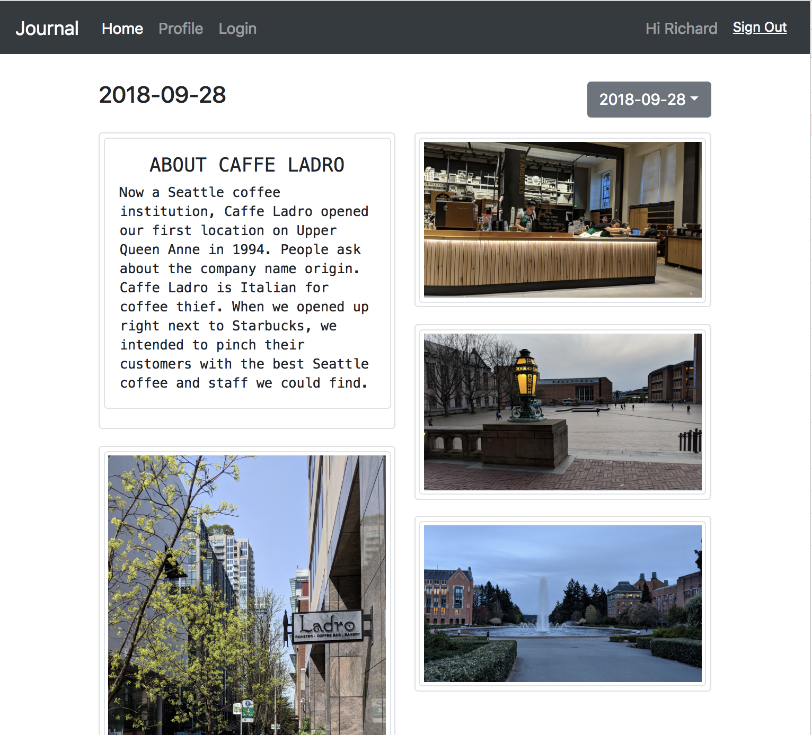

# Step 08 - Go Live

Now let's finalize and go live

* [1. Touch Ups](#1-touch-ups)
* [2. Build](#2-build)
* [3. Publish](#3-publish)

## 1. Touch Ups

Change icon, app title, and some small updates.

Not necessary to explain details in this step. Just check out the code should be fine.

## 2. Build

```
npm run build
```

The command generate everything needed into `build/` folder.

Remember to set `homepage` in your `package.json` if publishing to a [relative path](https://github.com/facebook/create-react-app/blob/master/packages/react-scripts/template/README.md#building-for-relative-paths)

## 3. Publish

This app is built completely in HTML/JS/CSS, no backend server needed. Just a static file hosting will do. Here we choose Amazon S3.

In [Step 02](../step-02) we created an AWS Mobile Hub project. During that step we have created everything that we needed for this app.

Go to AWS Console -> Mobile Hub. Click `Resources` on the top-right corner. Look for "Amazon S3 Buckets", then find the bucket that has `hosting` inside its name.

Upload files under `build/` folder to this bucket. Then open in browser. We are live!


